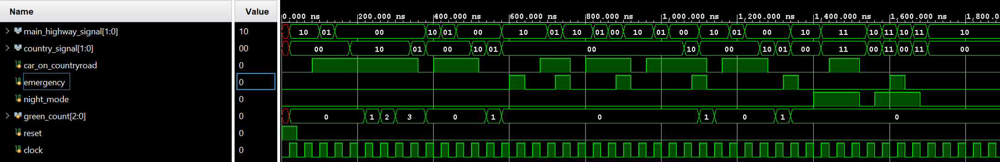
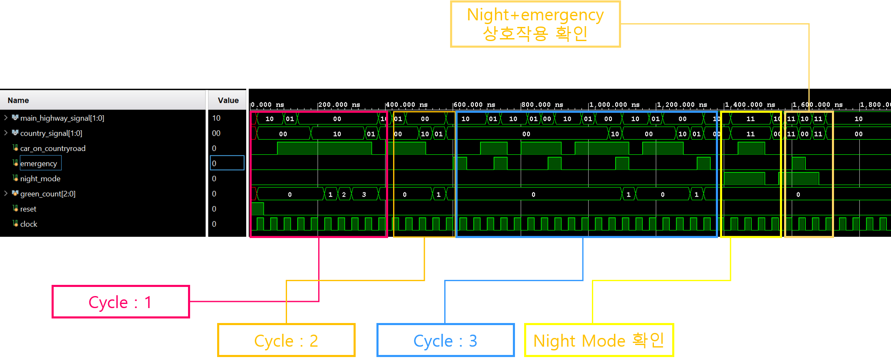
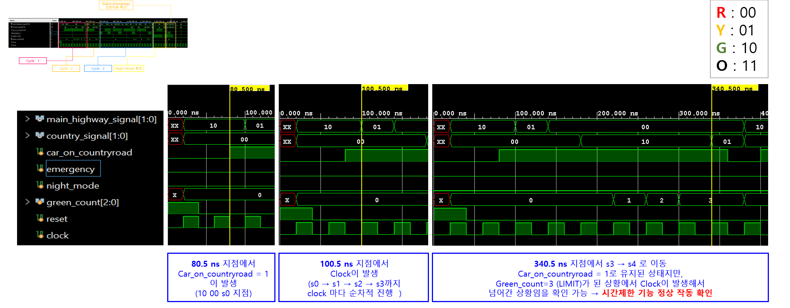
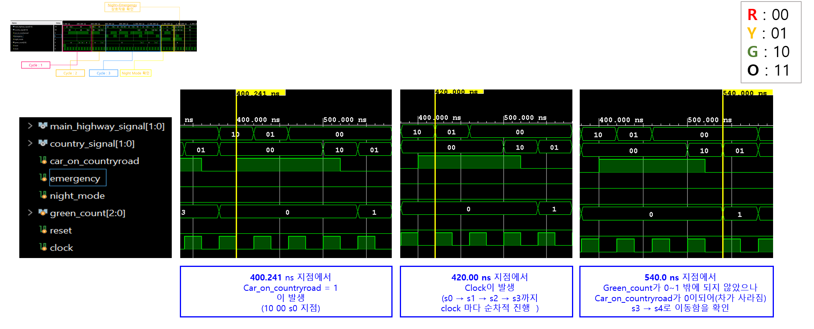
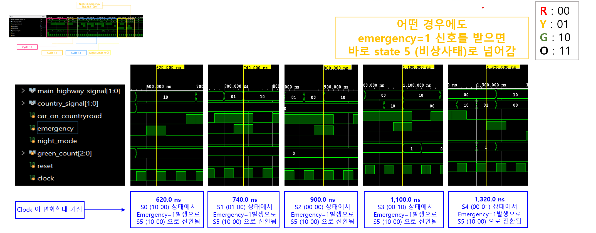
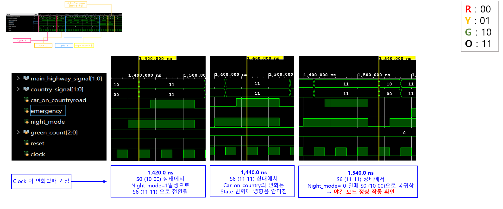
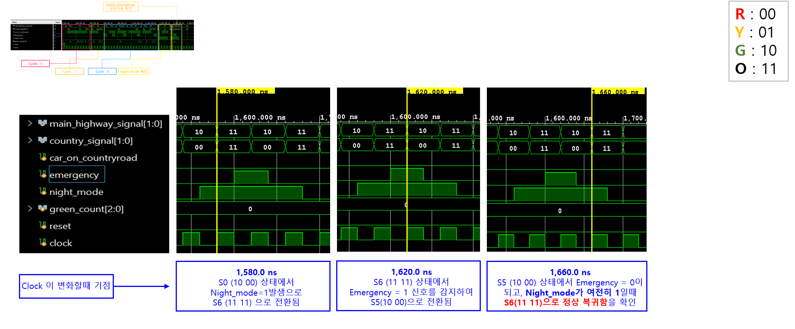
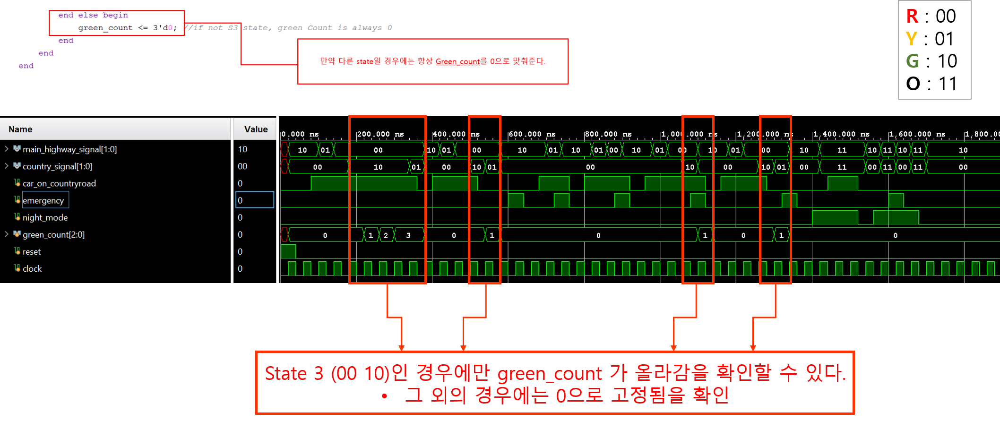

# 05. Simulation Analysis

## 1. Simulation Overview

Vivado behavioral simulation을 통해 개선된 Traffic Signal Controller가 의도한 대로 동작하는지 확인했습니다.

Simulation에서는 testbench에서 입력한 시나리오에 따라 다음 기능들을 검증했습니다.

* Normal Cycle 동작
* Country Road Green Time Limit
* `car_country` 변화에 따른 S3 종료
* Emergency Mode 우선 제어
* Night OFF Mode
* Night Mode 중 Emergency 발생 및 복귀
* `green_count` 동작

**Summary:**
This simulation verifies the improved traffic signal controller by checking normal cycles, green time limitation, emergency priority, Night OFF Mode, and the interaction between Night Mode and Emergency Mode.

---

## 2. Full Waveform Structure

전체 waveform은 testbench의 입력 시나리오에 따라 다음 구간으로 나누어 해석할 수 있습니다.




| Section             | Verification Target                        |
| ------------------- | ------------------------------------------ |
| Cycle 1             | `green_count`가 `GREEN_LIMIT`에 도달했을 때 S3 종료 |
| Cycle 2             | S3에서 `car_country = 0`이 되었을 때 S4 이동        |
| Cycle 3             | S0~S4 각 state에서 Emergency Mode 진입          |
| Night Mode          | S0 → S6, S6 유지, S6 → S0                    |
| Night + Emergency   | S6 → S5 → S6 → S0                          |
| Additional Analysis | `green_count`가 S3에서만 증가하는지 확인              |

**Summary:**
The full waveform is divided into several verification sections, each corresponding to a specific testbench scenario.

---

## 3. Cycle 1: Green Count Limit

Cycle 1은 Country Road에 차량이 계속 감지되는 상황에서도 Country Road Green 상태가 무한히 유지되지 않는지 확인하는 구간입니다.



Testbench에서는 `car_on_countryroad = 1`을 유지하여 FSM이 다음 흐름을 따르도록 했습니다.

```text
S0 → S1 → S2 → S3 → S3 유지 → S4 → S0
```

S3는 Country Road Green 상태입니다.
이때 출력은 다음과 같습니다.

| State | hwy     | cntry   | Meaning                               |
| ----- | ------- | ------- | ------------------------------------- |
| S3    | `2'b00` | `2'b10` | Main Highway Red / Country Road Green |

S3에 머무는 동안 `green_count`가 증가합니다.
`green_count < GREEN_LIMIT`이면 S3를 유지하고, `green_count >= GREEN_LIMIT`이 되면 S4로 이동합니다.

PPT simulation 해석 기준으로는, `car_on_countryroad = 1`이 유지된 상태였지만 `green_count`가 3, 즉 `GREEN_LIMIT`에 도달한 상황에서 clock이 발생하자 S3에서 S4로 이동했습니다.

이를 통해 Country Road에 차량이 계속 감지되어도 Green 상태가 무한정 유지되지 않고, 시간 제한 기능이 정상적으로 동작함을 확인했습니다.

**Summary:**
Cycle 1 confirms that Country Road Green does not last indefinitely. When `green_count` reaches `GREEN_LIMIT`, the FSM moves from `S3` to `S4` even if `car_country` remains high.

---

## 4. Cycle 2: Car Removed at S3

Cycle 2는 Country Road Green 상태인 S3에서 차량이 사라졌을 때, 제한 시간과 관계없이 S4로 이동하는지 확인하는 구간입니다.



Testbench에서는 처음에 `car_on_countryroad = 1`로 설정하여 FSM을 S3까지 이동시킨 뒤, S3 상태에서 `car_on_countryroad = 0`으로 변경했습니다.

예상 흐름은 다음과 같습니다.

```text
S0 → S1 → S2 → S3 → S4 → S0
```

S3의 next state logic은 다음 조건을 사용합니다.

```verilog
else if (car_country && (green_count < GREEN_LIMIT))
    next_state = S3;
else
    next_state = S4;
```

따라서 S3 상태에서 `car_country = 0`이 되면, `green_count`가 아직 `GREEN_LIMIT`에 도달하지 않았더라도 조건식이 false가 되어 S4로 이동합니다.

PPT simulation 해석 기준으로는, `green_count`가 아직 제한값에 도달하지 않았지만 `car_on_countryroad`가 0이 되었기 때문에 S3에서 S4로 이동했습니다.

이를 통해 Country Road 차량이 사라졌을 때 Green 상태를 정상적으로 종료하는 것을 확인했습니다.

**Summary:**
Cycle 2 confirms that the FSM exits `S3` when the Country Road vehicle is no longer detected, even before the green time limit is reached.

---

## 5. Cycle 3: Emergency Mode Verification

Cycle 3는 Emergency Mode가 모든 일반 상태보다 높은 우선순위를 갖는지 확인하는 구간입니다.



Testbench에서는 S0, S1, S2, S3, S4 각각의 상태에서 `emergency = 1`을 입력했습니다.

| Current State | Emergency Input | Expected Next State |
| ------------- | --------------- | ------------------- |
| S0            | `emergency = 1` | S5                  |
| S1            | `emergency = 1` | S5                  |
| S2            | `emergency = 1` | S5                  |
| S3            | `emergency = 1` | S5                  |
| S4            | `emergency = 1` | S5                  |

S5는 Emergency Mode이며 출력은 다음과 같습니다.

| State | hwy     | cntry   | Meaning                               |
| ----- | ------- | ------- | ------------------------------------- |
| S5    | `2'b10` | `2'b00` | Main Highway Green / Country Road Red |

PPT simulation에서는 S0, S1, S2, S3, S4에서 각각 emergency 신호를 발생시켰을 때 모두 S5로 이동하는 것을 확인했습니다.

이를 통해 신호등이 어떤 일반 상태에 있더라도 emergency 입력이 들어오면 우선적으로 Emergency Mode가 실행되는 것을 검증했습니다.

**Summary:**
The emergency simulation confirms that `emergency` has the highest priority and forces the FSM to move to `S5` from any normal traffic state.

---

## 6. Night OFF Mode Verification

Night Mode 검증은 `night_mode = 1`이 입력되었을 때 FSM이 S6로 이동하고, 두 신호등이 모두 OFF로 출력되는지 확인하는 구간입니다.



예상 흐름은 다음과 같습니다.

```text
S0 → S6 → S6 유지 → S0
```

S6는 Night OFF Mode이며 출력은 다음과 같습니다.

| State | hwy     | cntry   | Meaning                             |
| ----- | ------- | ------- | ----------------------------------- |
| S6    | `2'b11` | `2'b11` | Main Highway OFF / Country Road OFF |

PPT simulation 해석 기준으로는, S0 상태에서 `night_mode = 1`이 입력되자 S6로 이동했고, 두 출력이 모두 `2'b11`로 표시되었습니다.

또한 S6 상태에서 `car_on_countryroad` 값이 변해도 state 변화가 발생하지 않았습니다.

이는 S6의 next state logic에서 `car_country` 조건을 사용하지 않았기 때문입니다.

```verilog
S6: begin
    if (emergency)
        next_state = S5;
    else if (night_mode)
        next_state = S6;
    else
        next_state = S0;
end
```

따라서 Night OFF Mode에서는 Country Road 차량 감지가 state 변화에 영향을 주지 않습니다.

`night_mode = 0`이 되면 다음 clock에서 S6에서 S0으로 복귀합니다.

**Summary:**
Night OFF Mode verifies that both traffic lights output `2'b11` and that `car_country` does not affect state transitions while the FSM is in `S6`.

---

## 7. Night Mode with Emergency

Night Mode 중 Emergency가 발생하는 복합 상황도 검증했습니다.



예상 흐름은 다음과 같습니다.

```text
S0 → S6 → S5 → S6 → S0
```

동작 순서는 다음과 같습니다.

1. `night_mode = 1`이 되어 S0에서 S6로 이동
2. S6 상태에서 `emergency = 1`이 되어 S5로 이동
3. S5에서 Main Highway Green, Country Road Red 출력
4. `emergency = 0`이 되었지만 `night_mode = 1`이 유지되어 S6로 복귀
5. `night_mode = 0`이 되어 S0으로 복귀

S5의 출력은 다음과 같습니다.

| State | hwy     | cntry   | Meaning                               |
| ----- | ------- | ------- | ------------------------------------- |
| S5    | `2'b10` | `2'b00` | Main Highway Green / Country Road Red |

PPT simulation에서는 Night OFF Mode인 S6에서 emergency가 발생하자 S5로 이동했고, emergency가 종료된 뒤에도 `night_mode`가 유지되었기 때문에 S0이 아니라 S6로 복귀하는 것을 확인했습니다.

이를 통해 야간 중 응급차량이 발생하는 상황도 정상적으로 처리되는 것을 확인했습니다.

**Summary:**
This simulation verifies that emergency input overrides Night OFF Mode and that the FSM returns to `S6` after the emergency ends if `night_mode` is still active.

---

## 8. green_count Analysis

추가 분석으로 `green_count`가 어떤 상태에서 증가하는지 확인했습니다.



`green_count`는 모든 상태에서 증가하지 않고, 오직 S3, 즉 Country Road Green 상태에서만 증가합니다.

Design source에서는 다음과 같이 작성했습니다.

```verilog
if (state == S3) begin
    if (green_count < GREEN_LIMIT)
        green_count <= green_count + 3'd1;
    else
        green_count <= green_count;
end else begin
    green_count <= 3'd0;
end
```

따라서 S3가 아닌 S0, S1, S2, S4, S5, S6에서는 `green_count`가 0으로 초기화됩니다.

이 동작을 통해 `green_count`가 Country Road Green 유지 시간을 제한하기 위한 counter로만 사용되고 있음을 확인할 수 있습니다.

주의할 점은 `S3`의 state encoding과 output을 구분해야 한다는 것입니다.

| Item              | Value                          |
| ----------------- | ------------------------------ |
| S3 state encoding | `3'b011`                       |
| S3 output         | `hwy = 2'b00`, `cntry = 2'b10` |

즉, S3 자체는 `3'b011`로 encoding된 state이고, S3에서의 출력은 Main Highway Red, Country Road Green입니다.

**Summary:**
`green_count` increases only in `S3`, confirming that it is used only to limit the duration of Country Road Green.

---

## 9. Simulation Result Summary

Simulation 결과를 통해 다음 내용을 확인했습니다.

| Verification Item | Result                                |
| ----------------- | ------------------------------------- |
| Reset             | S0으로 정상 초기화                           |
| Normal Cycle 1    | `GREEN_LIMIT` 도달 시 S3 → S4            |
| Normal Cycle 2    | `car_country = 0`이면 제한 시간 전에도 S3 → S4 |
| Emergency Mode    | S0~S4 어디서든 emergency 발생 시 S5          |
| Night OFF Mode    | night_mode 입력 시 S6, 두 신호등 OFF         |
| Night + Emergency | S6 → S5 → S6 동작 확인                    |
| green_count       | S3에서만 증가, 다른 state에서는 0               |

---

## 10. Conclusion

Behavioral simulation을 통해 개선된 Traffic Signal Controller가 의도한 대로 동작함을 확인했습니다.

Emergency Mode는 일반 신호등 동작보다 높은 우선순위를 가졌고, Country Road Green Time Limit은 `green_count`를 통해 정상적으로 구현되었습니다.

Night OFF Mode에서는 두 신호등이 모두 OFF로 출력되었으며, Night Mode 중 Emergency가 발생해도 S5로 전환된 뒤 상황 종료 후 다시 S6로 복귀하는 것을 확인했습니다.

따라서 추가한 세 가지 기능이 FSM 구조 안에서 정상적으로 통합되었음을 확인할 수 있습니다.

**Summary:**
The behavioral simulation confirms that all added features are correctly integrated into the FSM and operate as intended.
