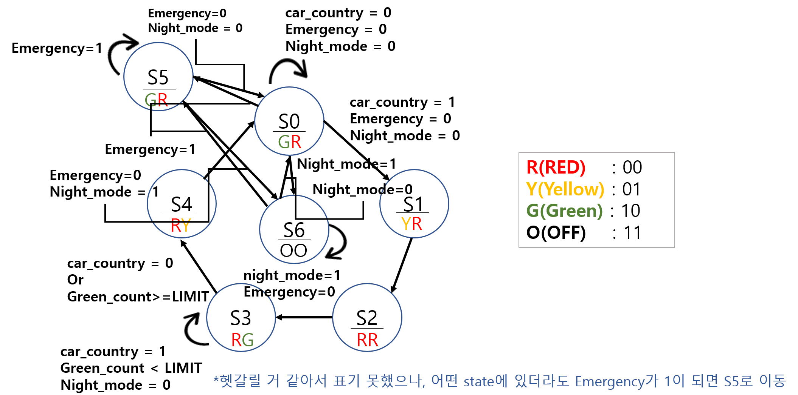

# 설계 상세보기

기존 Traffic Signal Controller를 분석하고, FSM 확장·Verilog 구현·testbench 작성·Vivado behavioral simulation 검증까지 진행한 전체 흐름입니다.

## 1. 프로젝트 배경

기본 신호등 제어기는 Main Highway와 Country Road의 정상 주기를 FSM으로 구현합니다.

```text
S0 → S1 → S2 → S3 → S4 → S0
```

본 프로젝트에서는 정상 주기만으로 처리하기 어려운 세 가지 상황을 추가했습니다.

- Emergency Mode
- Country Road Green Time Limit
- Night OFF Mode

[프로젝트 배경 문서](../docs/01_project_overview.html)

## 2. FSM 설계



기존 S0–S4에 Emergency Mode인 S5와 Night OFF Mode인 S6를 추가해 총 7개의 state를 사용했습니다. 출력은 현재 state에 의해 결정되는 Moore FSM 구조입니다.

| State | Main Highway | Country Road | Role |
|---|---|---|---|
| S0 | Green | Red | Default |
| S1 | Yellow | Red | Main transition |
| S2 | Red | Red | All Red |
| S3 | Red | Green | Country Green |
| S4 | Red | Yellow | Country transition |
| S5 | Green | Red | Emergency |
| S6 | OFF | OFF | Night OFF |

[전체 FSM 전이 규칙](../docs/02_fsm_design.html)

## 3. Verilog 구현

설계 코드는 다음 세 블록으로 구성했습니다.

1. State Register와 green_count
2. Next State Logic
3. Moore Output Logic

<div class="code-action-grid">
  <button class="code-open-button" type="button" data-code-file="src/traffic_signal_cntr_improved.v" data-code-title="Traffic Signal Controller Design Source">
    <strong>Design Source</strong>
    <span>7-state FSM·counter·output logic</span>
  </button>
  <button class="code-open-button" type="button" data-code-file="src/tb_traffic_signal_cntr_improved.v" data-code-title="Traffic Signal Controller Testbench">
    <strong>Testbench</strong>
    <span>기능별 입력 시나리오와 검증 흐름</span>
  </button>
</div>

[Verilog 코드 해석](../docs/03_verilog_code_explanation.html)

## 4. 기능별 동작

### Emergency Mode

`emergency = 1`이면 일반 state와 Night Mode에서 S5로 이동합니다. S5에서는 Main Highway가 Green, Country Road가 Red입니다.

### Country Road Green Time Limit

S3에서만 `green_count`를 증가시키고 `GREEN_LIMIT`에 도달하면 차량 감지가 유지되어도 S4로 이동합니다.

### Night OFF Mode

2-bit 출력 중 사용하지 않던 `2'b11`을 OFF로 정의했습니다. S6에서는 두 신호등을 모두 OFF로 출력하지만 emergency 입력은 계속 우선 처리합니다.

## 5. Testbench 설계

| Test | Verification Target |
|---|---|
| Reset | S0 초기화와 기본 출력 |
| Normal Cycle 1 | 차량 유지 시 GREEN_LIMIT 종료 |
| Normal Cycle 2 | 차량 제거 시 즉시 S4 전이 |
| Emergency | S0–S4에서 S5 우선 진입 |
| Night Mode | S6에서 두 출력 OFF |
| Night + Emergency | S6 → S5 → S6 복귀 |

[Testbench 구성 상세](../docs/04_testbench_design.html)

## 6. Behavioral Simulation


전체 파형에서 정상 주기, green_count, emergency, night_mode와 두 신호등 출력을 확인했습니다.

<div class="image-grid">
  <div class="resource-card">
    
    <strong>Green Time Limit</strong>
    <p>S3 유지와 GREEN_LIMIT 도달 후 S4 전이.</p>
  </div>
  <div class="resource-card">
    
    <strong>Emergency Priority</strong>
    <p>일반 state에서 S5로 우선 전이.</p>
  </div>
  <div class="resource-card">
    
    <strong>Night OFF Mode</strong>
    <p>S6에서 Main Highway와 Country Road 모두 OFF.</p>
  </div>
  <div class="resource-card">
    
    <strong>Night + Emergency</strong>
    <p>S6 → S5 → S6 전이 확인.</p>
  </div>
</div>

[파형 분석 상세](../docs/05_simulation_analysis.html)

## 7. 결과

- 7-state Moore FSM 정상 동작
- Emergency 입력의 최우선 처리
- Country Road Green 시간 제한
- Night OFF 출력과 emergency override
- `green_count`가 S3에서만 증가하고 다른 state에서 초기화
- Testbench 전 시나리오의 behavioral simulation 검증

## 8. 배운 점과 한계

이 프로젝트를 통해 FSM 상태 확장, counter 기반 timing control, non-blocking assignment, testbench 입력 구성과 waveform 해석을 연습했습니다.

현재 결과는 behavioral simulation 기준입니다. FPGA board I/O 연결, synthesis timing, 실제 clock divider와 물리 신호등 구동은 후속 단계에 해당합니다.
